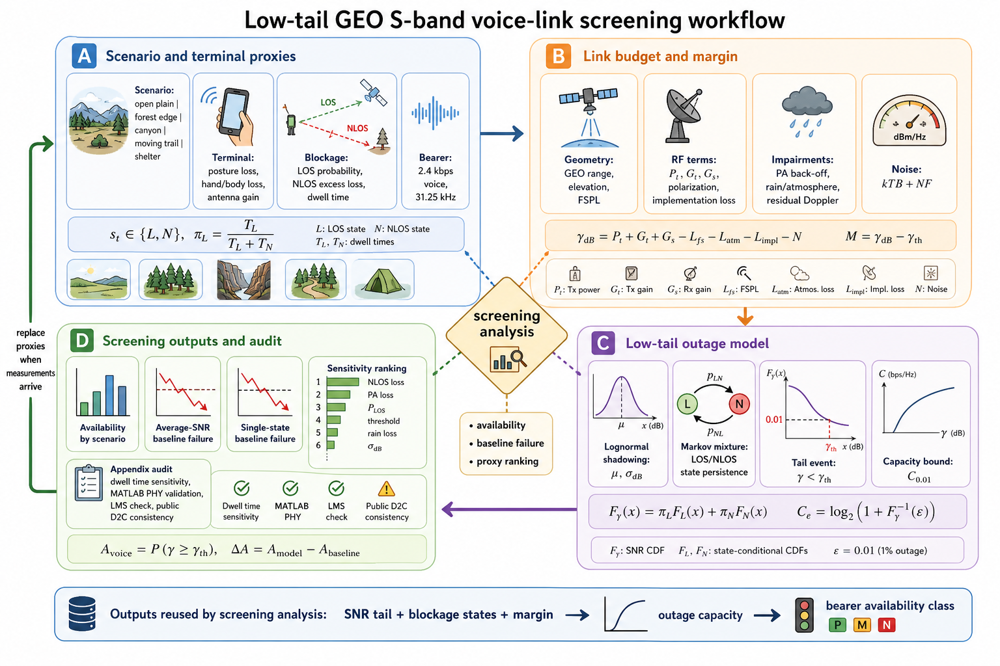

# GEO S-Band Satellite Phone Voice Link Toolkit

[中文说明](README.zh-CN.md)

This repository is a standalone open-source research toolkit for GEO S-band
satellite-phone voice-link screening. It estimates link closure, low-tail
capacity, and voice-bearer availability in remote-area scenarios.

The toolkit provides a public-parameter, vendor-neutral screening workflow for
estimating whether a handheld satellite-phone style terminal can close a
low-rate voice bearer under posture loss, shadowing, LOS/NLOS mixing, terrain
blockage, and low-tail outage-capacity constraints.

The repository is designed to be self-contained for GitHub release: Python
orchestrates the workflow, MATLAB Communications Toolbox calibrates the PHY
thresholds, Simulink runs the strict reference availability model, and Python
promotes that table into the public CSV/JSON outputs.

## Easiest Ways to Use It

You do not need MATLAB/Simulink for the normal engineering-facing entry points.
Use the full reference path only when you want to regenerate the promoted
reference tables from scratch.

| Goal | Easiest command | Output |
| --- | --- | --- |
| Read the released results | Open `README.md`, `RESULTS.md`, or `docs/index.html` | Figures, result tables, CSV links |
| Run a quick Python screen | `python quick_run.py` | `outputs/quick_run/quick_summary.*` |
| Test one scenario | `python quick_run.py --scenario canyon --added-loss-db 2` | Console table plus quick report |
| Open the visual dashboard | `streamlit run app.py` | Browser UI with sliders and plots |
| Change parameters in a notebook | Open `examples/quick_start.ipynb` | Editable research workflow |
| Regenerate full reference outputs | `python run_all.py` | MATLAB/Simulink-backed reference outputs |

For a minimal command-line setup:

```bash
python -m pip install -r requirements-lite.txt
python quick_run.py
```

For the dashboard:

```bash
python -m pip install -r requirements-dashboard.txt
streamlit run app.py
```

## What This Toolkit Does

- Builds a generic GEO S-band satellite-phone voice-link approximation.
- Computes narrowband carrier budgets, voice availability, and outage-capacity
  validation outputs.
- Compares average-SNR and single-state screening against a LOS/NLOS mixture
  model to expose low-tail risk.
- Ranks sensitivity to NLOS loss, LOS probability, PA compression, rain loss,
  voice threshold, posture, shadowing, and residual Doppler.
- Provides strict MATLAB/Simulink co-simulation scripts for reference
  PHY-threshold availability, with LMS scripts retained as validation checks.

This is not a proprietary handset implementation, field-test dataset, or vendor
calibration package.

## Key Results

For the 2.4 kbps voice bearer, the mixture model gives the following baseline
availability:

| Scenario | Availability | P10 Eb/N0 |
| --- | ---: | ---: |
| Open plain | 100.00% | 19.48 dB |
| Forest edge | 99.29% | 14.67 dB |
| Canyon valley | 84.31% | 1.65 dB |
| Moving trail | 66.37% | -2.95 dB |
| Tent/shelter | 36.07% | -14.48 dB |

Average-SNR screening over-simplifies the decision boundary, and the
single-state lognormal model overstates the tent/shelter result by 60.45
percentage points. The largest tested sensitivity is NLOS excess loss, with a
maximum availability swing of 15.69 percentage points.

See [RESULTS.md](RESULTS.md) for the fuller result summary and pointers to the
CSV/PNG/PDF artifacts under `expected_outputs/`.

## Visual Results

The figures below are committed under `expected_outputs/figures/all/` so they render
directly on GitHub.

<p align="center">
  
</p>

<p align="center">
  
</p>

<p align="center">
  
</p>

<p align="center">
  
</p>

<p align="center">
  
</p>

## Repository Layout

```text
.
├── README.md
├── README.zh-CN.md
├── RESULTS.md
├── PUBLIC_RELEASE.md
├── LICENSE
├── requirements.txt
├── requirements-lite.txt
├── requirements-dashboard.txt
├── quick_run.py
├── run_all.py
├── app.py
├── examples/
│   └── quick_start.ipynb
├── docs/
│   └── index.html
├── src/
│   ├── tiantong_sband_link.py
│   ├── outage_capacity_bound.py
│   ├── voice_link_reference.py
│   └── screening_analysis.py
├── expected_outputs/
│   ├── data/
│   └── figures/
└── matlab_voice_link/
```

## Full Installation

Create a Python environment and install the full set of optional packages:

```bash
python -m venv .venv
source .venv/bin/activate  # Windows: .venv\Scripts\activate
python -m pip install -r requirements.txt
```

Then run the full reference workflow:

```bash
python run_all.py
```

This requires MATLAB, Simulink, and Communications Toolbox. MATLAB is detected
from `MATLAB_EXE`, then `matlab` on `PATH`, then `D:\matlab\bin\matlab.exe`.
`python run_all.py --skip-reference-cosim` is development-only. It runs the
Python-only scripts and skips screening-analysis artifacts that require the
MATLAB/Simulink reference outputs.

The workflow writes newly generated artifacts to `outputs/`:

```text
outputs/
├── quick_run/
├── data/
│   ├── voice_link/
│   ├── outage_capacity/
│   ├── screening_analysis/
│   └── reference_cosim/
├── figures/
│   ├── all/
│   └── screening_report/
└── archive/
```

`outputs/` is intentionally ignored by Git. `archive/` is only for local legacy
run artifacts. Reference CSV/PDF artifacts used by the paper are committed under
`expected_outputs/`.

## Interactive and Static Views

- `app.py` provides a Streamlit dashboard for scenario selection, proxy-parameter
  sliders, availability/baseline comparison, sensitivity ranking, and figure
  viewing.
- `examples/quick_start.ipynb` is a notebook workflow for researchers who want
  to change proxy parameters and inspect tables in Python.
- `docs/index.html` is a static GitHub Pages result page. Enable GitHub Pages
  from the repository `docs/` folder to publish it.

## Expected Outputs

Important generated files include:

- `outputs/quick_run/quick_summary.csv`
- `outputs/quick_run/quick_summary.md`
- `outputs/data/voice_link/voice_availability.csv`
- `outputs/data/voice_link/screening_baseline_comparison.csv`
- `outputs/data/voice_link/screening_sensitivity_ranking.csv`
- `outputs/data/voice_link/dwell_time_sensitivity.csv`
- `outputs/data/outage_capacity/outage_capacity_results.json`
- `outputs/data/screening_analysis/screening_analysis_results.json`
- `outputs/figures/all/geo_satphone_c0p01_sensitivity_ranking.pdf`
- `outputs/figures/all/geo_satphone_dwell_time_sensitivity.pdf`

## MATLAB/Simulink Co-Simulation

The MATLAB/Simulink workflow is required for reference outputs. It requires
MATLAB, Simulink, and Communications Toolbox.

From MATLAB:

```matlab
cd("matlab_voice_link")
run_voice_link_reference_cosim("../outputs/data/reference_cosim/voice_link_cosim_manifest.json")
```

Normally `run_all.py` creates the manifest and invokes this entry point through
`matlab.exe -batch`. Expected MATLAB staging outputs are written to
`outputs/data/reference_cosim/`, and Python promotes canonical outputs to
`outputs/data/voice_link/`. See
[MATLAB_SIMULINK.md](MATLAB_SIMULINK.md) for details.

## Notes and Scope

- Random seeds are fixed in the Python scripts.
- The repository uses public-style proxy parameters and sensitivity sweeps, not
  proprietary measurements.
- Some plots may emit harmless Matplotlib layout/font warnings depending on the
  local environment.
- Numerical values can change slightly across NumPy/SciPy/Matplotlib versions,
  but the qualitative rankings should remain stable.

## License

This project is released under the MIT License. See [LICENSE](LICENSE).
