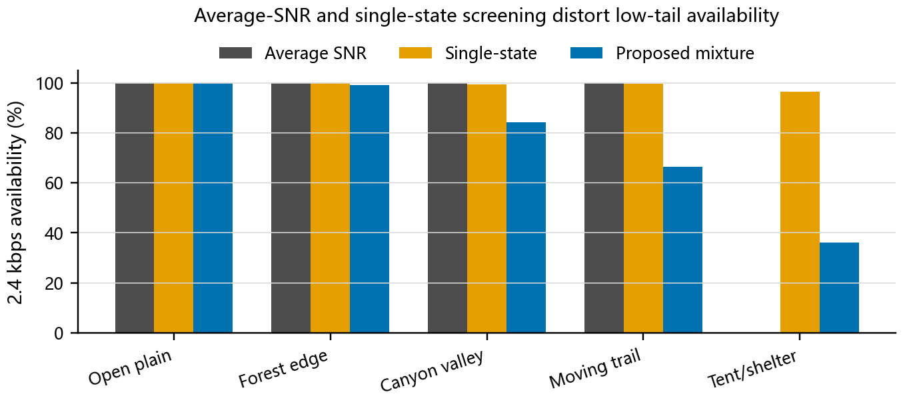
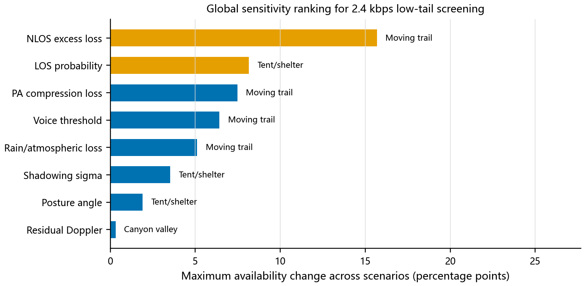
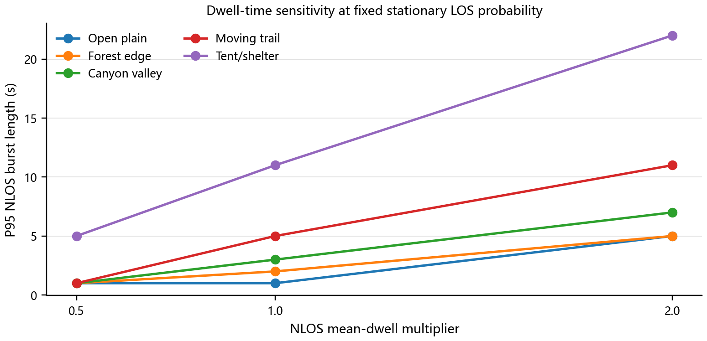
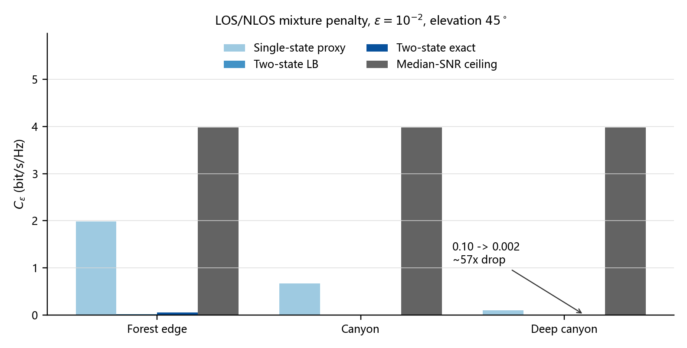

# GEO S-band 卫星手机语音链路工具

[English README](README.md)

这是一个面向科研和工程验证的开源工具项目，用于评估 GEO S-band 卫星手机语音链路在远程地区是否能稳定闭合。它不是某个手机厂商或某个终端的专有实现，也不包含私有实测数据；它提供的是一套透明、可运行、可修改的链路侧基线模型。

本项目的落点是 GEO S-band 卫星手机语音链路筛选：给出链路闭合、低尾容量、语音 bearer 可用性和 MATLAB/Simulink 参考联合仿真的可运行工具。

## 这个项目能做什么

- 计算 GEO S-band 卫星手机窄带语音链路预算。
- 评估 2.4 kbps 语音 bearer 在开阔地、林缘、峡谷、移动路径、帐篷/遮挡等场景下的可用性。
- 比较平均 SNR 筛选、单状态 lognormal 模型和 LOS/NLOS 混合模型的差异。
- 输出中断容量、低尾 Eb/N0、灵敏度排序和 dwell-time 影响。
- 提供严格 MATLAB/Simulink 联合仿真脚本，用于生成参考 PHY 门限可用性结果；LMS 脚本保留为验证检查。

## 核心结论

在 2.4 kbps 语音 bearer 设置下，LOS/NLOS 混合模型得到的基线可用性如下：

| 场景 | 可用性 | P10 Eb/N0 |
| --- | ---: | ---: |
| Open plain | 100.00% | 19.48 dB |
| Forest edge | 99.29% | 14.67 dB |
| Canyon valley | 84.31% | 1.65 dB |
| Moving trail | 66.37% | -2.95 dB |
| Tent/shelter | 36.07% | -14.48 dB |

平均 SNR 筛选会过度简化决策边界，单状态 lognormal 模型会在帐篷/遮挡场景中高估 60.45 个百分点。灵敏度分析显示，NLOS excess loss 是测试参数中影响最大的因素，最大可用性变化为 15.69 个百分点。

更完整的结果说明见 [RESULTS.md](RESULTS.md)，参考输出在 `expected_outputs/` 目录中。

## 结果图示

以下图片已提交到 `expected_outputs/figures/all/`，可以在 GitHub README 中直接显示。

<p align="center">
  
</p>

<p align="center">
  
</p>

<p align="center">
  
</p>

<p align="center">
  
</p>

## 快速开始

创建 Python 环境并安装依赖：

```bash
python -m venv .venv
source .venv/bin/activate  # Windows: .venv\Scripts\activate
python -m pip install -r requirements.txt
```

运行完整参考主流程：

```bash
python run_all.py
```

该流程需要 MATLAB、Simulink 和 Communications Toolbox。MATLAB 检测顺序为
`MATLAB_EXE`、`matlab` on `PATH`、`D:\matlab\bin\matlab.exe`。
`python run_all.py --skip-reference-cosim` 仅用于开发调试。它只运行 Python
脚本，并跳过依赖 MATLAB/Simulink 参考输出的筛选分析产物。

运行后会在 `outputs/` 下生成新的 CSV、JSON 和图件：

```text
outputs/
├── data/
│   ├── voice_link/
│   ├── outage_capacity/
│   ├── screening_analysis/
│   └── reference_cosim/
├── figures/
│   ├── all/
│   └── screening_report/
└── archive/
```

`outputs/` 不提交到 Git。`archive/` 只保存本机旧运行残留；论文使用的参考 CSV/PDF 已放在 `expected_outputs/`，便于直接查看。

## 目录说明

```text
.
├── README.md              # 英文说明
├── README.zh-CN.md        # 中文说明
├── RESULTS.md             # 结果摘要
├── PUBLIC_RELEASE.md      # 开源发布说明
├── requirements.txt       # Python 依赖
├── run_all.py             # 主入口
├── src/                   # Python 计算脚本
├── expected_outputs/      # 已整理的参考输出
└── matlab_voice_link/          # MATLAB/Simulink 参考联合仿真脚本
```

## MATLAB/Simulink

MATLAB/Simulink 部分是参考流程。没有 MATLAB、Simulink 或 Communications Toolbox
时，可以用 `--skip-reference-cosim` 做 Python-only 开发调试，但不会生成完整参考结果。

在 MATLAB 中运行：

```matlab
cd("matlab_voice_link")
run_voice_link_reference_cosim("../outputs/data/reference_cosim/voice_link_cosim_manifest.json")
```

通常由 `run_all.py` 自动生成 manifest 并通过 `matlab.exe -batch` 调用该入口。
更详细说明见 [MATLAB_SIMULINK.md](MATLAB_SIMULINK.md)。

## 适用边界

- 本项目使用公开风格参数和代理场景，不使用专有终端测量数据。
- 本项目不是某个具体手机、卫星载荷、波形或入网流程的实现。
- 随机种子已固定；不同 NumPy/SciPy/Matplotlib 版本下数值可能有轻微差异，但主要排序和结论应保持稳定。

## 许可证

本项目使用 MIT License，见 [LICENSE](LICENSE)。
